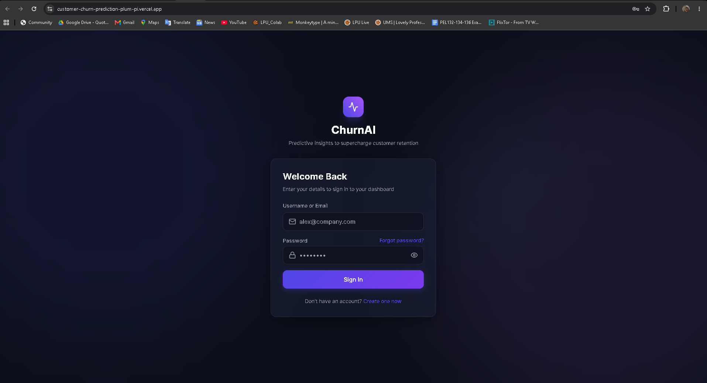
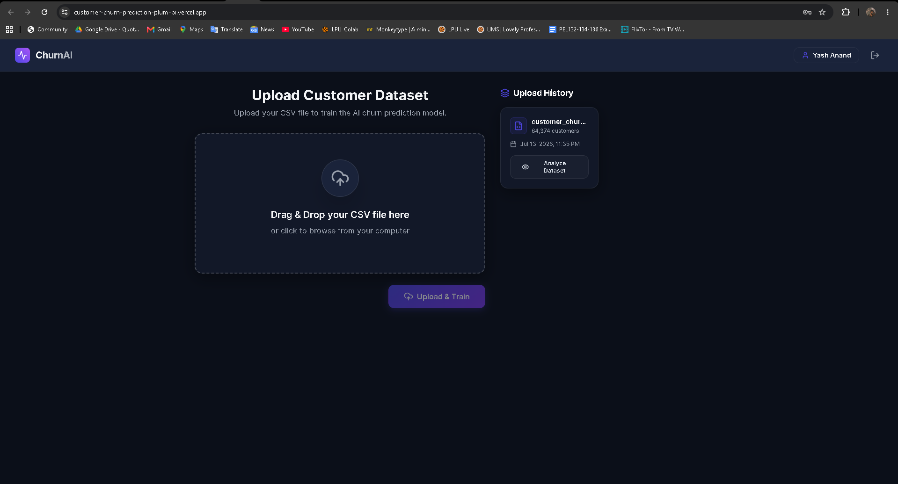
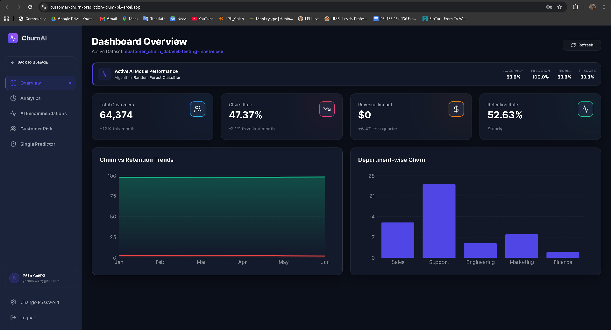
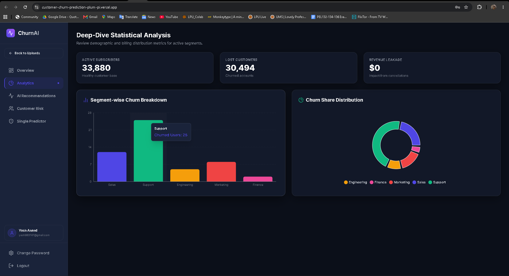
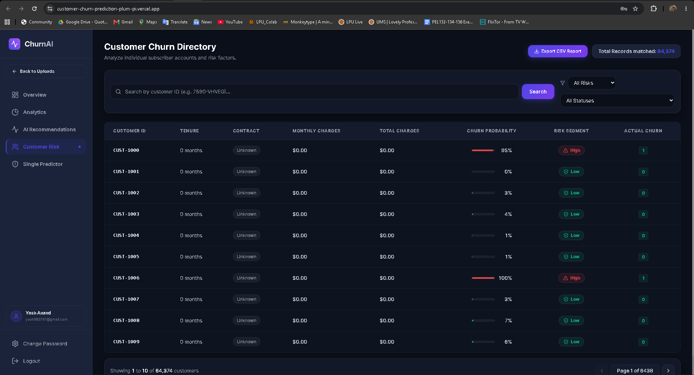
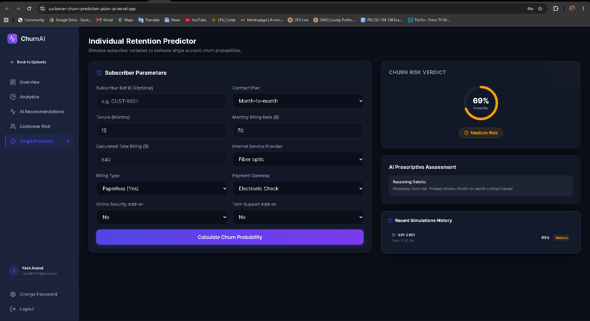

# ChurnAI - AI Customer Churn Prediction Dashboard

**ChurnAI** is a modern, end-to-end customer churn prediction platform that turns standard subscriber datasets into actionable retention intelligence. Built with React, TypeScript, Tailwind CSS, FastAPI, SQLite, and Scikit-Learn, it supports secure authentication, dataset uploads, user-isolated model training, interactive analytics, and AI-driven retention recommendations.


---

## 🔗 Live Deployment Links

* 🖥️ **Frontend Client (Vercel)**: [customer-churn-prediction-plum-pi.vercel.app](https://customer-churn-prediction-plum-pi.vercel.app)
* ⚙️ **Backend API Server (Render)**: [customer-churn-backend-0xco.onrender.com](https://customer-churn-backend-0xco.onrender.com)

---

## 📸 Visual Showcase

Screenshots from the deployed application include the full workflow of the user experience:

| 🔐 Authentication Portal | 📁 Main Page - Upload Workspace |
| --- | --- |
|  |  |
| *Frosted glass login, registration, and OTP password recovery.* | *Drag & drop CSV zones with SQLite-powered historical uploads tracking.* |

| 📊 Overview Dashboard | 📈 Segment Analytics |
| --- | --- |
|  |  |
| *Active AI Model metrics header, KPIs, and monthly churn trends.* | *Recharts visualizations breaking down contract and payment ratios.* |

| 🗂️ Customer Risk Directory | 🔮 Profile Simulator Ledger |
| --- | --- |
|  |  |
| *Paginated risk grid with search filters and CSV report exports.* | *Manual account predictor with gauge verdicts and dynamic AI advice.* |

---

## 🌟 Key Features

* **Secure Authentication & Account Security**:
  * Fully featured login, account creation, and password updates.
  * Robust password reset system utilizing One-Time Passwords (OTPs) generated securely and logged to `backend/data/otp_logs.txt` for easy testing.
  * Complete multi-user isolation: Each account has its own isolated dataset uploads and custom trained ML models.
* **Upload-Centered Main Landing Page**:
  * Sleek landing workspace focusing on **Drag-and-Drop Dataset Uploads** and an **Upload History** ledger of previous files.
  * Other analytical pages are securely locked until a dataset is active.
  * Restores analysis sessions instantly from history with a single click.
* **Live Interactive Analysis View**:
  * Unlocks a comprehensive sidebar routing system when a dataset is loaded.
  * **Overview Dashboard**: Renders dynamic KPI cards and lifetime customer retention trends computed directly from the uploaded CSV.
  * **AI Model Performance Diagnostics**: Displays live accuracy metrics (Precision, Recall, F1 Score, and Algorithm type) saved during model training.
  * **Deep-Dive Analytics**: Segment analysis (bar and pie charts) detailing churn proportions across plans and providers.
  * **AI Recommendations**: Adaptive recommendation playbooks based on billing charges and contract formats.
  * **Customer Directory & CSV Exporter**:
    * Paginated data table listing subscriber accounts with churn risk segments (Low, Medium, High).
    * Search records by Customer ID and filter by risk ratings or churn outcomes.
    * **Export CSV Report**: Downloads a custom spreadsheet report of the filtered search query containing their computed AI risk verdicts.
  * **Individual Forecast Simulator**:
    * Simulated manual input calculator to estimate churn probability for a custom subscriber profile.
    * Generates dynamic rule-based AI reasoning explanations based on input metrics.
    * Maintains a recent simulation run ledger in the SQLite database.

---

## 🛠️ Tech Stack

* **Frontend**: React (TypeScript, Vite), Tailwind CSS (Layers & Custom Utilities), Framer Motion, Recharts, Lucide Icons
* **Backend**: FastAPI, SQLite (via SQLAlchemy declarations)
* **ML Core**: Scikit-Learn (Random Forest & Logistic Regression Classifiers), Joblib serialization, Pandas, Numpy

---

## 📂 Project Structure

```
Customer Churn Prediction/
├── backend/
│   ├── api/
│   │   ├── auth.py         # Registration, logins, and OTP resets
│   │   ├── upload.py       # User-isolated uploads and history mapping
│   │   ├── ml_pipeline.py  # Model metrics query and simulator
│   │   └── analytics.py    # Live KPI calculations and paginated directory
│   ├── ml/
│   │   └── trainer.py      # Batch preprocessing, modeling, and explanations
│   ├── models/
│   │   ├── database.py     # SQLAlchemy User, Upload, and Prediction schemas
│   │   └── schema.py       # Pydantic schemas
│   ├── utils/
│   │   └── security.py     # Cryptographic password hashing and HMAC tokens
│   ├── data/               # Git-ignored SQLite DB, uploads, and OTP logs
│   ├── main.py             # Server router mapping and CORS rules
│   └── requirements.txt
├── frontend/
│   ├── src/
│   │   ├── components/
│   │   │   ├── auth/       # AuthPage and ChangePasswordModal
│   │   │   ├── layout/     # Sidebar layout navigation
│   │   │   ├── upload/     # DragDropUpload and HistoryList
│   │   │   └── dashboard/  # CustomerList, SinglePredictor, AnalyticsDeepDive
│   │   ├── services/
│   │   │   ├── api.ts      # Axios config, interceptor, and analytics helpers
│   │   │   └── auth.ts     # Account queries
│   │   ├── App.tsx         # Tab router, states, and app orchestration
│   │   ├── index.css       # Tailwind directives and custom component styles
│   │   └── main.tsx
│   ├── package.json
│   └── tailwind.config.js
└── README.md
```

---

## 🚀 Setup Instructions

### 1. Backend Setup

Open a terminal and navigate to the backend directory:
```bash
cd backend
```

Activate the virtual environment:
```bash
# On Windows (PowerShell/CMD):
.\venv\Scripts\activate

# On Mac/Linux:
source venv/bin/activate
```

Start the FastAPI application:
```bash
uvicorn main:app --reload
```
The backend API server will run locally at `http://localhost:8000`.

### 2. Frontend Setup

Open a new terminal and navigate to the frontend directory:
```bash
cd frontend
```

Start the Vite dev server:
```bash
npm run dev
```
The frontend client will run locally at `http://localhost:5173`. Open this URL in your web browser.

---

## 🔑 Verification & Test Scenarios

1. **Simulating Forgot Password (OTP Verification)**:
   * Go to the login screen and click **Forgot Password**.
   * Enter your account's email and select **Send OTP**.
   * Open the newly generated local security file `backend/data/otp_logs.txt` to retrieve your 6-digit code.
   * Input the code and type a new password to reset it.
2. **Uploading a Dataset**:
   * Log in. You will land on the Upload area.
   * Drag and drop a standard customer CSV dataset (e.g., Telco Customer Churn).
   * Once model training is complete, the application automatically redirects you to the Dashboard.
3. **Analyzing Customer Churn**:
   * Click **Customer Risk** to search for individual subscribers and filter risk ratings. Click **Export CSV Report** to download the list.
   * Navigate to **Single Predictor** to manually adjust contract plans or bills and observe the dynamic churn verdict.

---

## 👤 Author

* **Yash Anand** — Creator of ChurnAI, focused on building polished end-to-end AI workflows for customer retention analysis and deployment-ready user experiences.

---

## 📝 Project Summary

* **Secure login and account management** with OTP password recovery.
* **User-scoped dataset uploads** that train custom churn models automatically.
* **Live analytics and insights** with KPI cards, churn trends, and segment charts.
* **AI-driven recommendations** for retention strategies based on churn drivers.
* **Customer churn directory** with search, filtering, and export support.
* **Individual churn simulator** for on-demand probability forecasts.
